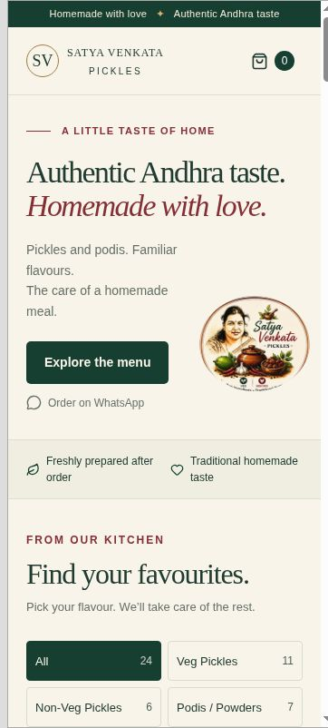

# Satya Venkata Pickles

**Live website:** https://satya-venkata-pickles.chnikhil137.chatgpt.site

[Download ready-to-host static website](deploy/satya-venkata-pickles-static.zip) · [QA record](QA.md) · [Original menu](docs/original-menu.jpg)



A real, mobile-first Andhra pickles and podis storefront. React 19 + TypeScript + Vite; static hosting, no server, database, authentication or secret environment variables.

## Run

Requires Node.js 22.13 or newer and pnpm 10+.

```sh
pnpm install --frozen-lockfile
pnpm dev
```

Open http://localhost:4173. If dependencies are already installed, `npm run dev` is equivalent.

## Verify and build

```sh
pnpm test
pnpm build
pnpm start
```

The production output is `dist/`. `npm test`, `npm run build` and `npm start` also work with the installed dependencies.

## Deploy

- **Netlify:** Import this project, use `npm run build`, and publish `dist`. Or run the build locally and drag the `dist` folder into Netlify's manual deployment screen.
- **Vercel:** Import this project, select **Vite**, use `npm run build`, output directory `dist`. The included `vercel.json` configures these settings.
- **Any static host:** Upload the contents of `dist`. There are no server routes or environment secrets.
- **Sites:** `.openai/hosting.json` identifies the registered site; the Sites workflow publishes the same static `dist` output.

## Edit the business

- `src/data/products.ts` — single source for all 24 products, 36 size/price variants, categories and product IDs. Prices are in INR, not paise.
- `src/config/business.ts` — brand name, both WhatsApp numbers, currency, delivery notice, factual claims and special-order occasions. WhatsApp numbers must contain country code and digits only, e.g. `919908116937`.
- `src/styles/main.css` — visual identity and responsive layouts.
- `src/utils/order.ts` — totals, saved-cart validation, customer validation and encoded WhatsApp messages.
- `src/components/CartDrawer.tsx` — cart and checkout.

The only in-page image is a crop of the original supplied menu artwork. The existing illustrated portrait was preserved; no replacement person or food photos were generated.

## Ordering behavior

1. Filter or search products, select an available size and quantity, then add to the order.
2. The cart is saved locally on that browser. Prices are always read from the current product catalogue, never from saved browser data.
3. Enter a name and valid Indian mobile number; area, city and notes are optional. Customer details are kept only in memory, not persisted.
4. **Order on WhatsApp** opens `wa.me` with the actual cart and customer details. The customer must tap **Send** in WhatsApp. Opening the link does not confirm an order.
5. The business confirms delivery charges and payment in WhatsApp. The website does not take payments or claim the message was delivered.
6. **Copy order summary** copies the same summary, with a selection fallback if clipboard access is unavailable.

Up to 99 packs can be selected per product/size; larger requests can use the special-order enquiry. No availability, lead time, shelf life, discounts or minimum-order amounts are invented.

## Jar QR codes / reorder links

Use the final public URL for a printed QR code. Append `?product=mango-pickle` to highlight and scroll to that product. Any ID in `products.ts` works. Invalid IDs safely open the normal menu. Printing QR artwork is not part of this build.

## QA

See `QA.md`. Run the 35 automated checks with `pnpm test`.

For manual responsive verification, copy `tests/qa-responsive.html` into `public/qa-responsive.html`, start the dev server and open `/qa-responsive.html`. The harness uses real iframe viewport widths, can enlarge text and can capture a checkout URL locally without contacting WhatsApp. Remove it from `public` before building for production.

Browser WebMCP read tools are progressively registered when supported. They only read the menu/current cart and never send an order. Ordinary browsers use the complete visual interface.
